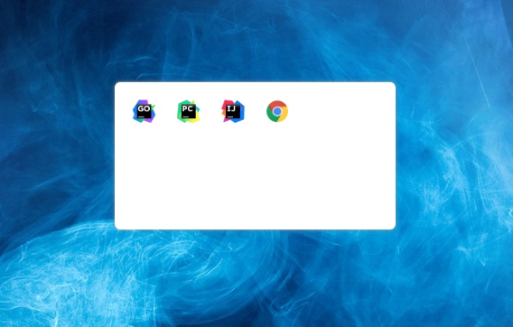
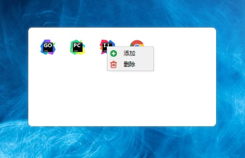

# controlPanel

## 适用场景
在任务栏隐藏并且当前应用是全屏时需要启动其他应用。

## 如何使用
[点击下载](https://github.com/geebos/controlPanel/releases/download/1.0.0/controlPanel.zip)

解压之后进入解压后的文件夹，点击 controlPanel.exe 启动应用程序。

通过全局快捷键 `ctrl+q` 唤出启动台，再次按下快捷键隐藏启动台.

可以将桌面的快捷方式添加到启动台中，在启动台双击对应的图标即可启动应用。

## 如何修改快捷键
暂时没有开发出来，如果确实需要修改的话，在解压文件夹中找到 `config.json` 修改里面的 `shortcut` 即可。

## 如何退出
如需要退出应用在右下角图标中找到   右键，点击退出。

## 示例

